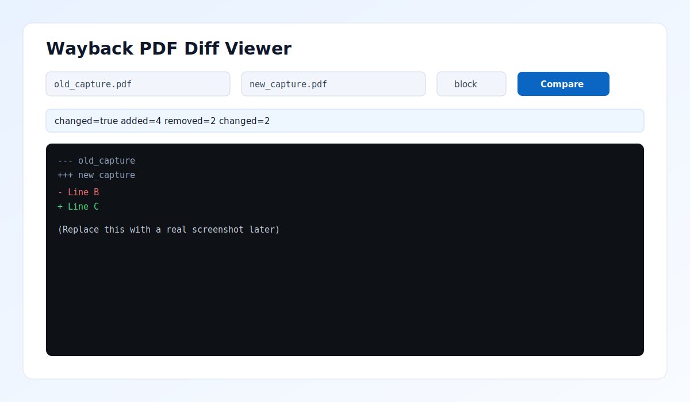
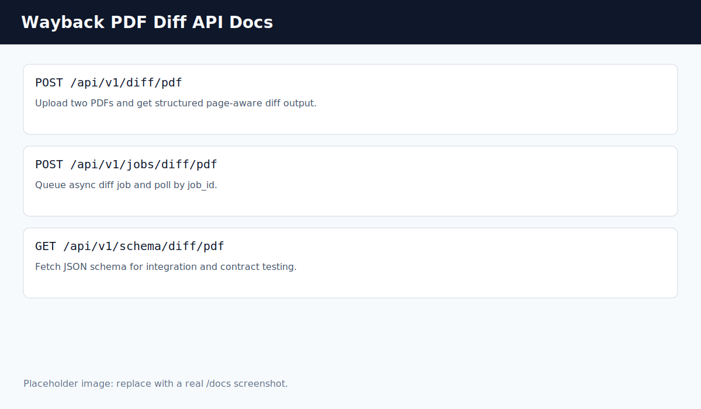

# Wayback PDF Diff

Wayback PDF Diff compares two PDF captures and returns a structured, page-aware difference payload.

It is designed as a practical backend foundation for the Internet Archive "Wayback PDF Changes" idea.

## What It Does

- Extracts text from each PDF page and normalizes whitespace.
- Supports optional OCR fallback for low-text pages.
- Computes differences in two modes:
  - `line` mode for line-by-line changes
  - `block` mode for grouped paragraph-like changes
- Detects likely moved content (`delete + insert` can become `move`).
- Returns rich metadata:
  - summary counts (added/removed/changed)
  - per-page line references
  - extraction quality information
  - runtime metrics and timing
- Offers both synchronous and asynchronous APIs.
- Includes a browser viewer, CLI, JSON schema, Docker support, and CI.

## Screenshots

Current repository includes screenshot placeholders you can replace with real captures:




To capture real screenshots quickly:

1. Run the server.
2. Open `http://127.0.0.1:8000/viewer` and `http://127.0.0.1:8000/docs`.
3. Capture images and save to `docs/screenshots/`.
4. Keep the same filenames to auto-update this README.

## Feature Summary

- Page-aware diff hunks
- Unified diff text output
- OCR-ready extraction pipeline
- Move detection heuristic
- JSON schema contract endpoint
- Async in-memory job queue and polling
- HTML render endpoint
- CLI export workflow
- Docker containerization
- GitHub Actions test workflow

## Project Structure

- `src/pdf_diff/extractor.py`: extraction and OCR hooks
- `src/pdf_diff/diff_engine.py`: diff engine, move detection, metrics
- `src/pdf_diff/api.py`: FastAPI endpoints (sync, async jobs, schema, viewer)
- `src/pdf_diff/cli.py`: command-line interface
- `pdf_diff_cli.py`: root CLI launcher for src-layout project
- `main.py`: root API entrypoint for local run and Docker
- `docs/diff-response.schema.json`: static schema artifact
- `docs/screenshots/`: README screenshot assets
- `.github/workflows/ci.yml`: test automation

## Quick Start

```powershell
python -m venv .venv
.\.venv\Scripts\Activate.ps1
pip install -r requirements.txt
```

Run API:

```powershell
.\.venv\Scripts\python.exe -m uvicorn main:app --host 127.0.0.1 --port 8000
```

Useful URLs:

- Swagger UI: `http://127.0.0.1:8000/docs`
- Viewer UI: `http://127.0.0.1:8000/viewer`
- Health: `http://127.0.0.1:8000/health`

## API Endpoints

### 1) Synchronous Diff

`POST /api/v1/diff/pdf`

Form fields:

- `old_capture` (PDF file)
- `new_capture` (PDF file)
- `context` (default 3, range 0..20)
- `granularity` (`line` or `block`)
- `enable_ocr` (`true` or `false`)

### 2) Async Diff Job

`POST /api/v1/jobs/diff/pdf` to create job, then poll:

`GET /api/v1/jobs/{job_id}`

Statuses: `queued`, `running`, `completed`, `failed`

### 3) Contract Schema

`GET /api/v1/schema/diff/pdf`

Static schema file also available at:

- `docs/diff-response.schema.json`

### 4) HTML Render

`POST /api/v1/render/html`

Returns a rendered HTML page containing summary and unified diff text.

## CLI Usage

```powershell
.\.venv\Scripts\python.exe pdf_diff_cli.py old.pdf new.pdf --granularity block --out diff.json
```

Options:

- `--context N`
- `--granularity line|block`
- `--enable-ocr`
- `--out path.json`

## Example Response (trimmed)

```json
{
  "schema_version": "2026-03-29",
  "changed": true,
  "summary": {
    "lines_added": 1,
    "lines_removed": 1,
    "lines_changed": 1
  },
  "metrics": {
    "granularity": "line"
  },
  "hunks": [
    {
      "op": "replace"
    }
  ]
}
```

## Testing

```powershell
.\.venv\Scripts\python.exe -m pytest
```

## Docker

```powershell
docker build -t wayback-pdf-diff .
docker run --rm -p 8000:8000 wayback-pdf-diff
```

## OCR Notes

OCR is optional. If OCR dependencies are missing, API still works and reports warnings in extraction quality fields.

Optional dependencies:

- `pytesseract`
- `pdf2image`

System tools for OCR:

- Tesseract OCR
- Poppler

## CI

GitHub Actions workflow runs tests on every push and pull request:

- `.github/workflows/ci.yml`

## Contributing

1. Create a branch from `main`.
2. Keep changes small and focused.
3. Add or update tests.
4. Run `pytest` locally.
5. Open a PR with sample input/output details.
